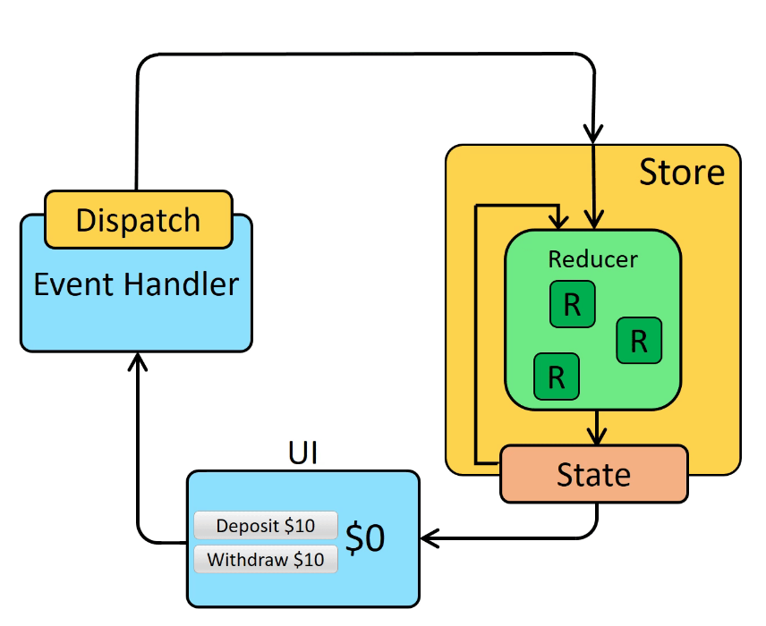

# 13-REDUX


# 리덕스란?

- 자바스크립트 상태관리 라이브러리
  
### 기존 상태값 관리의 단점  

다른 파일의 상태값을 해당js파일에 넘기려면 props를 사용해야 한다. ⇒ 자식컴포넌트에게는 가능하지만 코드 유지보수가 불편함  
### redux 장점
- 부모 컴포넌트에서 깊은 곳에 있는 자식 컴포넌트에 상탯값을 전달할 때 좋음
- 페이지가 전환되어도 데이터는 살아 있어야 할 때 좋음
- 상태값을 저장하는 통합 저장소(store)를 만듦, 저장소의 상태값을 활용한다.  
- 여러 컴포넌트가 개별적으로 관리하는 상태값들을 하나의 소스에 모아서 통합관리
- 컴포넌트끼리 상태 공유할 때 여러 컴포넌트를 거치지 않고(기존에는 props로 하위 파일로 전달→전달→전달 함) 상태값을 전달, 업데이트 가능

### 리액트에서의 리덕스 사용 방법
`yarn add redux react-redux` 명령어로 패키지 설치

### 리덕스 흐름
  
1. UI에서 사용자에 의해 이벤트가 발생  
2. dispatch가 reducer를 호출해서 action을 넘겨줌
3. 전달 받은 action을 store에서 상태를 업데이트 함

### 액션
 : 발생한 이벤트 객체, 데이터  
액션은 어플리케이션으로부터 온 데이터를 스토어에 전송하는 정보의 페이로드(payloads)
- `페이로드(payload)`는 **전송되는 데이터**
    - json으로 보는 실제 데이터에서의 payload는 아래의 json에서 “data”입니다. 그 이외의 데이터들은 전부 통신을 하는데 있어 용이하게 해주는 부차적인 정보들입니다
    
    ```jsx
    {
    	"status" : 
    	"from": "localhost",
    	"to": "http://melonicedlatte.com/chatroom/1",
    	"method": "GET",
    	"data":{ "message" : "There is a cutty dog!" }
    }
    ```
### 디스패치
 : 액션을 전달받아 리듀서를 호출한다

### 리듀서
   : 액션을 전달 받은 디스패치를 통해 호출되어 스토어의 state상태를 업데이트한다.  
변화를 일으키는 함수 state와 action을 파라미터로 받아옴  
- reducer의 action 파라미터는 dispatch할 때 보낸 object다
- 리듀서 함수가 맨 처음 호출될 때는 state 값이 undefined 이므로 함수의 parameter에 기본값을 설정해야 한다.
  
### 스토어
 : 상태가 관리되는 공간
