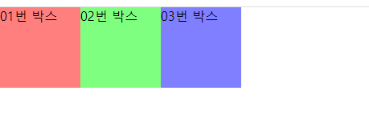
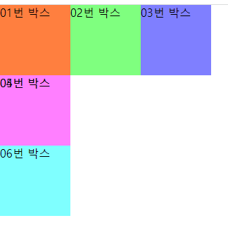
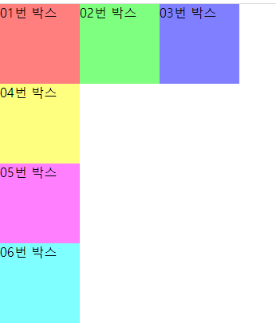
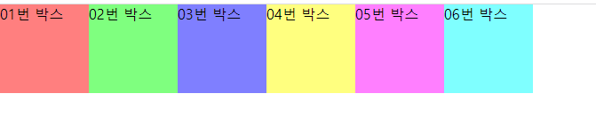
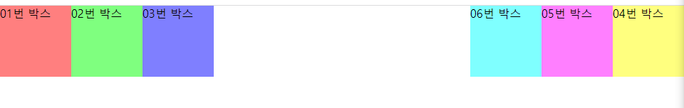
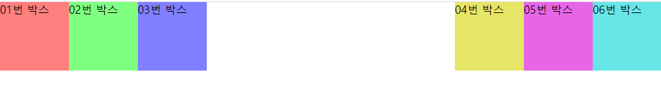

# float

# float속성

### float 속성

- 이미지와 텍스트들을 어떻게 배치할 건 지에 대해 정의하기 위해 존재
- 요소가 어떻게 떠야 하는지를 지정
- float: left  
: 왼쪽에 배치 ⇒ 이미지 - 왼쪽, 텍스트 - 이미지를 감싸면서 배치
- float: right  
: 오른쪽에 배치
- float: none  
: 레이아웃 정렬X
- initial  
: 기본값으로 초기화 상태
- inherit  
: 상위 태그의 정렬 속성을 상속받아서 정렬시킴

### clear 속성

- float 해제하는 속성
- left, right, both (보통 both 많이 씀)

---

`div 박스`는 **block 속성을 가지고**, **세로로 쌓이면서 정렬되는 게 기본**입니다. 이 **div박스를 가로로 정렬하고 싶을 때 float:left; 속성을 사용**합니다.

```css
#box01 {background-color: rgba(255, 0, 0, .5); float: left;}
#box02 {background-color: rgba(0, 255, 0, .5); float: left;}
#box03 {background-color: rgba(0, 0, 255, .5);float: left;}
```



float속성이 적용된 요소의 다음에 따라오는 요소에 영향을 끼쳐 그 뒤에 오는 요소가 밑으로 깔려 들어간다

```css
#box01 {background-color: rgba(255, 0, 0, .5); float: left;}
#box02 {background-color: rgba(0, 255, 0, .5); float: left;}
#box03 {background-color: rgba(0, 0, 255, .5);float: left;}

#box04 {background-color: rgba(255, 255, 0, .5);}
#box05 {background-color: rgba(255, 0, 255, .5);}
#box06 {background-color: rgba(0, 255, 255, .5);}
```



float속성을 적용할 때 주의할점  
**float속성이 적용된 요소**의 다음에 **따라오는 요소(깔린 요소)**에 영향을 끼쳐 그 뒤에 오는 요소가 밑으로 깔려 들어가기 때문에 **해당 요소에 clear:both; 속성을 이용해 float 속성을 해제**합니다.

```css
#box01 {background-color: rgba(255, 0, 0, .5); float: left;}
#box02 {background-color: rgba(0, 255, 0, .5); float: left;}
#box03 {background-color: rgba(0, 0, 255, .5);float: left;}

#box04 {background-color: rgba(255, 255, 0, .5); clear: both;}
#box05 {background-color: rgba(255, 0, 255, .5);}
#box06 {background-color: rgba(0, 255, 255, .5);}
```

  

box01~06까지 왼쪽부터 가로로 정렬

```css
#box01 {background-color: rgba(255, 0, 0, .5); float: left;}
#box02 {background-color: rgba(0, 255, 0, .5); float: left;}
#box03 {background-color: rgba(0, 0, 255, .5);float: left;}

#box04 {background-color: rgba(255, 255, 0, .5); float: left;}
#box05 {background-color: rgba(255, 0, 255, .5); float: left;}
#box06 {background-color: rgba(0, 255, 255, .5); float: left;}
```

  

flaot: right 하면 순서가 오른쪽부터 붙는다  
float: right; 속성은 화면 우측의 박스를 가로로 정렬할 수 있지만 순서가 뒤바뀝니다.(오른쪽부터 순서대로 붙기 때문)

```css
#box01 {background-color: rgba(255, 0, 0, .5); float: left;}
#box02 {background-color: rgba(0, 255, 0, .5); float: left;}
#box03 {background-color: rgba(0, 0, 255, .5); float: left;}

#box04 {background-color: rgba(255, 255, 0, .5); float: right;}
#box05 {background-color: rgba(255, 0, 255, .5); float: right;}
#box06 {background-color: rgba(0, 255, 255, .5); float: right;}
```

  

묶어주는 부모 박스 안에서 float해준다  
박스를 우측에 붙이되 순서를 지키고 싶을 경우,  
전체를 감싸는 부모박스(컨테이너 역할)를 하나 더 만들어 float:right; 시킨 다음 그 안에 들어가는 요소들에 float:left; 를 해주면 됩니다.(컨테이너 안에서 또다시 가로로 정렬)

```css
#box01 {background-color: rgba(255, 0, 0, .5); float: left;}
#box02 {background-color: rgba(0, 255, 0, .5); float: left;}
#box03 {background-color: rgba(0, 0, 255, .5); float: left;}

#right_container {width: 300px; height: 100px; background-color: rgba(0, 0, 0, .2); float: right;}
#box04 {background-color: rgba(255, 255, 0, .5); float: left;}
#box05 {background-color: rgba(255, 0, 255, .5); float: left;}
#box06 {background-color: rgba(0, 255, 255, .5); float: left;}

<body>
    <div id="box01">01번 박스</div>
    <div id="box02">02번 박스</div>
    <div id="box03">03번 박스</div>

    <div id="right_container">
        <div id="box04">04번 박스</div>
        <div id="box05">05번 박스</div>
        <div id="box06">06번 박스</div>
    </div>  
</body>
```

