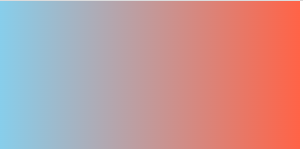
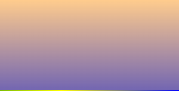

# gradient

# 그라디언트

- 기본형태

`background-image: linear-gradient(방향 또는 각도, 색상1, 색상2);`  

```css
#box01 {
	width: 300px; height: 100px;
	background-image: linear-gradient(to left, tomato, skyblue);
}
```



---

색상블록(색상정지점:color-stop)에는 rgb, rgba, hsl, hsla, 색상명, 헥사코드 모든 컬러 단위가 들어갈 수 있음. 이때, 콤마와 괄호 등을 짝을 잘 맞춰서 사용할 것

```css
#box02 {
  width: 300px; height: 100px;
  background-image: linear-gradient(to bottom, rgba(255,150,80,.5), rgba(80,60,150,.5));
}
```



---

방향은 모서리쪽으로 보내려면 두개의 방향 키워드를 같이 써주면 됩니다.(순서 상관X)
2개 이상~~~ 컬러를 여러 개 넣을 수 있다.

```css
#box03 {
	width: 300px; height: 100px;
	background-image: linear-gradient(to top right, red, green, yellow, blue);
}
```


---

### 웹브라우저 벤더 프리픽스(vendor prefix)

 : 지원이 안되는 속성을 브라우저에서 지원할 수 있게끔 지정  
제일 아래부터 단계적으로 적용  
지원되지 않는 구 브라우저는 첫번째 작성  
**CSS표준 문법은** 벤더 프리픽스를 모두 적용하고 **제일 마지막에 적용**  

```css
#box04 {
    width: 300px; height: 300px;
    /* 지원되지 않는 구 브라우저에서 나타낼 색상(첫번째 작성) */
    background-color: #0f0;
    /* 웹브라우저 벤더 프리픽스(vendor prefix) : 지원이 안되는 속성을 브라우저에서 지원할 수 있게끔 지정
    제일 아래부터 단계적으로 적용 */
    background-image: -moz-linear-gradient(45deg, #0f0, #f00, #0ff);
    background-image: -o-linear-gradient(45deg, #0f0, #f00, #0ff);
    background-image: -webkit-linear-gradient(45deg, #0f0, #f00, #0ff);
    /* 표준 속성은 항상 맨 마지막에 작성할 것 */
    background-image: linear-gradient(45deg, #0f0, #f00, #0ff);
}
```

---

색상 블록 안에 색상중지점의 위치를 지정해줄 수 있다.  
0%(시작지점색상) ~ 100%(종료지점색상)  
퍼센트를 지정하지 않으면 자동으로 같은 비율로 나눠서 들어간다.  

```css
#box05 {
	width: 300px; height: 300px;
	background-image: linear-gradient(45deg, #0f0 0%, #f00 30%, #00f 80%);
	/* 시작 0%는 생략가능 */
}
```

---

 

원형 그라데이션(가운데부터 색상 순서대로)

```css
#box06 {
	width: 300px; height: 150px;
	background-image: radial-gradient(red, green, blue);
}
```

