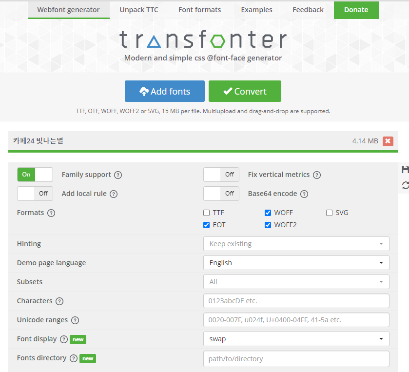

# webfont

## WebFont

- 웹페이지를 보는 사람의 컴퓨터에 글꼴이 설치 되어 있지 않아도, 임시로 글꼴을 받아 웹페이지에서 볼 수 있도록 하는 폰트의 한 종류
    - 적용방법
        - CDN방식 : 타서버의 주소를 연결하여 적용
        - 서버에 직접 업로드 후 적용
- 사용자(웹페이지를 보는 사람)의 컴퓨터에 깔려있지 않은 서체를 지정할 경우, 서체가 적용 안됨.  
그래서 모든 사용자에게 동일 서체를 표현하기 위해서 웹에 폰트를 올리고, 그 폰트로 보여주는 게 '웹폰트'입니다.
    - 영문서체 : 구글폰트  
    한글서체 : 눈누(상업적 무료 서체 모음)
- <link>태그로 가지고 오는 경우 <head> 안에 붙여넣기 후 fong-family로 지정  
- @import 또는 @font-face로 가지고 오는 경우 CSS에 붙여 넣는다.

---

### **font-size**

- 절대크기 : 브라우저에서 지정한 글자 크기
- 상대크기 : 부모요소의 글자 크기를 기준으로 상대적인 글자 크기를 지정  
ex) em
- 크기 : 브라우저와 상관없이 글자 크기를 직접 지정
- 백분율: 부모 요소의 글자 크기를 기준으로 백분율(%)로 표시

---

### **font-weight**

- 글자 굵기를 지정하는 속성

`font-weight : 100~900;`  
100단위로 지정 가능(서체에 따라 지원 여부가 모두 다르기 때문에 확인 후 사용 요망!)  
lighter(100), normal(400), bold(700), bolder 많이 사용  

100은 lighter  

400은 nomal  

700은 bold  

```css
h1 {font-weight: lighter;}
/* h1 {font-weight: 100;} */
```

---

### font-family

- 글꼴의 종류  
(굴림, 맑은고딕, 돋움, 굴림 등…)

`font-family : 서체1, 서체2, 서체3...;`  
서체1이 적용 안될 경우 서체2 적용...제일 마지막에는 가장 비슷한 기본 스타일 지정  
ex : font-family : '나눔고딕', 돋움, 굴림, sans-serif;  
font-family : '제주명조', 명조, serif;  

---

### text-align

- 문단의 정렬

---

### 폰트 사이트 추천 = [**구글 폰트**](https://fonts.google.com/?subset=korean)

폰트 선택→폰트→우측상단 **Selected families** → 복사하고 파일에 넣기  

link 방식 : head 태그 에 추가  

import 방식 : style 태그에 추가(css파일에 넣을 수도 있다)  

- font-family 적용 방법

CSS rules to specify families 에 있는 내용 style 태그에 복사 붙여넣기  

```css
<head>
  <link rel="preconnect" href="https://fonts.googleapis.com">
  <link rel="preconnect" href="https://fonts.gstatic.com" crossorigin>
  <link href="https://fonts.googleapis.com/css2?family=IBM+Plex+Sans+KR:wght@100;300;400;500;700&family=Rubik+Distressed&display=swap" rel="stylesheet">
</head>

<style>
    p:first-of-type {font-family: 'IBM Plex Sans KR', sans-serif;}
    p:nth-child(3) {font-family: 'Rubik Distressed', cursive;}
</style>
```

---

### 폰트 사이트 추천 = [**눈누**](https://noonnu.cc/)

- font-family 적용 방법

```css
<style>
  @font-face {
	font-family: 'ghanachoco';
	src: url('https://cdn.jsdelivr.net/gh/projectnoonnu/noonfonts_20-04@1.0/ghanachoco.woff') format('woff');
	font-weight: normal;
	font-style: normal;
  }
  p:nth-child(4) {font-family: 'ghanachoco';}
</style>
```

---

### 영문 폰트 사이트 추천 = [**다폰트**](https://www.dafont.com/)

저작권 유의

---

### 원하는 폰트가 없을 때 변환하고 싶을 때= [**트랜스폰터**](https://transfonter.org/)

- 내서버에 업로드해서 폰트 가져오기

Add fonts 하기  

convert → 다운로드 → 파일 근처에 압축 풀기  

해당 폰트css파일 메모장으로 열어서 복사 붙여넣기  

파일 경로(url)를 제대로 설정해주기  


