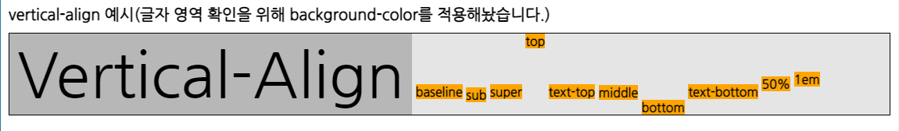

# vertical-align

# CSS vertical-align 속성

## inline/inline-block 속성을 가진 엘리먼트나 테이블의 셀 안에서 수직(세로 축)정렬에 관한 속성입니다.예시로,  요소가 block 요소 안에 있을 경우 공백이 발생하는데, 이 공백은 vertical-align:top; 속성을 지정해 없애줄 수 있습니다.

- 속성값 : `baseline | sub | super | top | text-top | middle | bottom | text-bottom | <percentage> | <length> | inherit`
- 기본값 : baseline
- 적용 대상 : 인라인 요소와 테이블 셀
- 상속 여부 : No
- 퍼센트 : 요소의 line-height 값 참조
- 산출값 : 길이와 퍼센트값은 절대 길이이며, 이외는 지정한 값

## vertical-align 속성값

- baseline : 인라인 박스의 베이스라인을 부모박스의 베이스라인에 정렬합니다. 기본값입니다. (baseline 이란, g 또는 y 처럼 소문자의 꼬리부분을 뺀 하단 선을 말합니다.)
- sub : 인라인 박스의 베이스라인을 부모박스의 아래첨자 문자로 적당한 위치로 낮추며, 글꼴 크기에는 영향을 주지 않습니다.
- super : 인라인 박스의 베이스라인을 부모박스의 윗첨자 문자로 적당한 위치로 올리며, 글꼴 크기에는 영향을 주지 않습니다.
- top : 인라인 박스의 맨위를 부모박스의 라인박스의 윗변에 정렬합니다.
- text-top : 인라인 박스의 맨위를 부모 엘리먼트 글꼴의 맨 위에 정렬합니다.
- middle : 인라인 박스의 수직 중간점을 부모박스의 베이스라인에 소문자 'x' 높이의 반(1/2)만큼 올려 정렬합니다. 그러므로 완벽하게 중앙정렬이 되지 않습니다.
- bottom : 인라인 박스의 아랫변을 라인박스의 바닥에 정렬합니다.
- text-bottom : 인라인 박스의 맨 아래를 부모 엘리먼트 글꼴의 맨 아래에 정렬합니다.
- 길이 : 해당 길이만큼 인라인 박스를 올립니다. (내릴 때에는 음수를 사용, '0'은 baseline를 의미)
- 백분율 : 해당 백분율을 line-height 속성 값의 백분율 길이 만큼 올리거나 내립니다. (올릴 땐 양수, 내릴 땐 음수, '0'은 baseline를 의미)

### 참고 :[https://opentutorials.org/course/718/3903](https://opentutorials.org/course/718/3903)[https://www.w3schools.com/cssref/pr_pos_vertical-align.asp](https://www.w3schools.com/cssref/pr_pos_vertical-align.asp)[http://blog.hivelab.co.kr/%EA%B3%B5%EC%9C%A0-vertical-align-%ED%8C%8C%ED%97%A4%EC%B9%98%EA%B8%B0-1%EB%B6%80/](http://blog.hivelab.co.kr/%EA%B3%B5%EC%9C%A0-vertical-align-%ED%8C%8C%ED%97%A4%EC%B9%98%EA%B8%B0-1%EB%B6%80/)