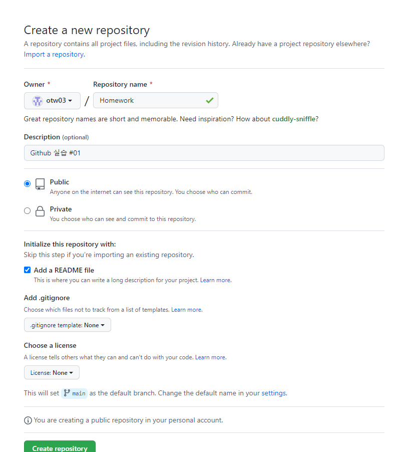
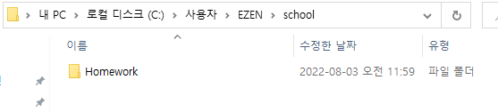
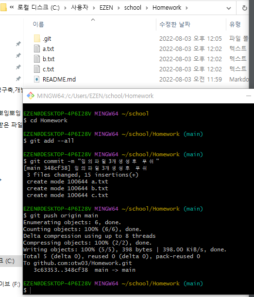
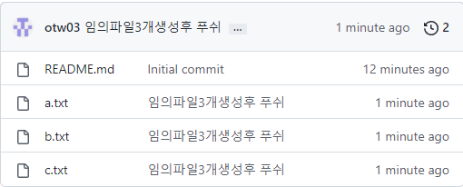
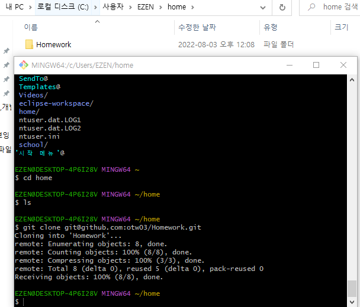
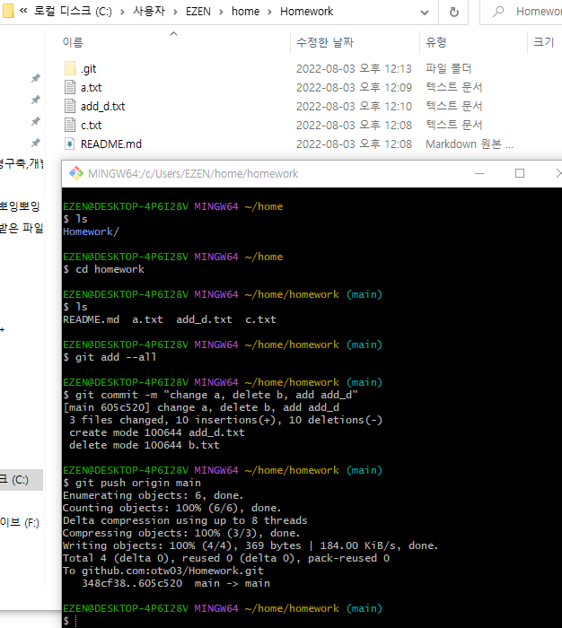
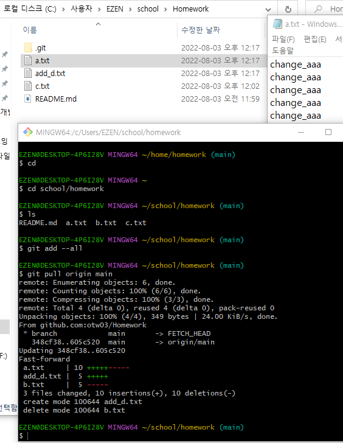
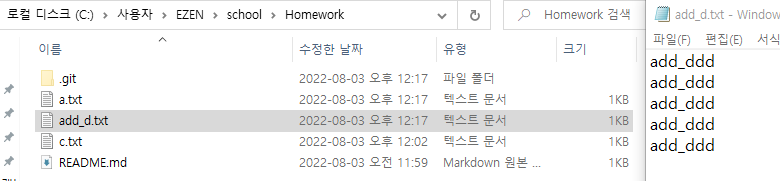
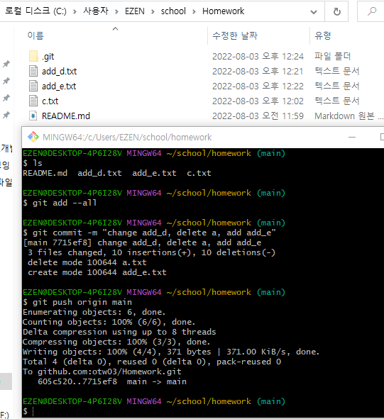
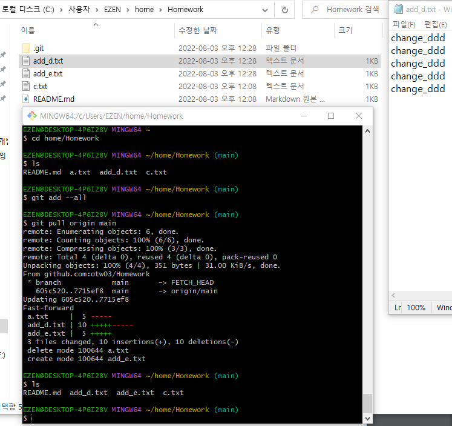

# Git준비하기

## Git으로 프로젝트 관리하기

## 주요Git 명령어

### 내 작업 내역을 저장소에 업로드 하기

- 현재 프로젝트 폴더의 변경사항들을 스테이지에 등록

`git add --all`  

- 스테이지에 등록된 변경사항을 커밋 → 원격지 저장소 업로드 대기상태로 만듦
- * add와 commit은 내가 작업중인 로컬 PC에서 여러번 수행할 수 있다.

`git commit -m "작업내용에 대한 간략한 코멘트"`  

- 커밋 내역을 모아서 원격지 저장소에 업로드

`git push origin main`  

- 원격지 저장소의 내용 내려받기

`git pull origin main`  

---

# 오태원 Github 실습1

1. Github에 프로젝트 생성 —> 프로젝트이름은 각자 정함

2. 사용자 홈 폴더 안에 school 이라는 이름의 폴더를 만들고 그 안에서 clone받기

3. clone받은 프로젝트 안에서 임의의 파일을 3개 이상 생성하고 push

4. 사용자 홈 폴더 안에 home이라는 이름의 폴더를 만들고 새롭게 clone받기

5. home안에 받은 내용에 하나의 파일은 수정, 하나의 파일은 삭제, 새로운 파일 하나 추가 -> push

6. school 안에서 pull 받은 후 변경 내용이 반영 되었는지 확인

7. school안에 받은 내용에 하나의 파일은 수정, 하나의 파일은 삭제, 새로운 파일 하나 추가 -> push

1. home 안에서 pull 받은 후 변경 내용이 반영 되었는지 확인

⇒ 각 과정별로 하나 이상의 스크린샷을 저장한 후 markdown 보고서 제출

---

팀 작업에서 유의할 점

- 다른 사람이 작업한 파일은 직접 수정하지 않고 수정을 요청해야 한다.