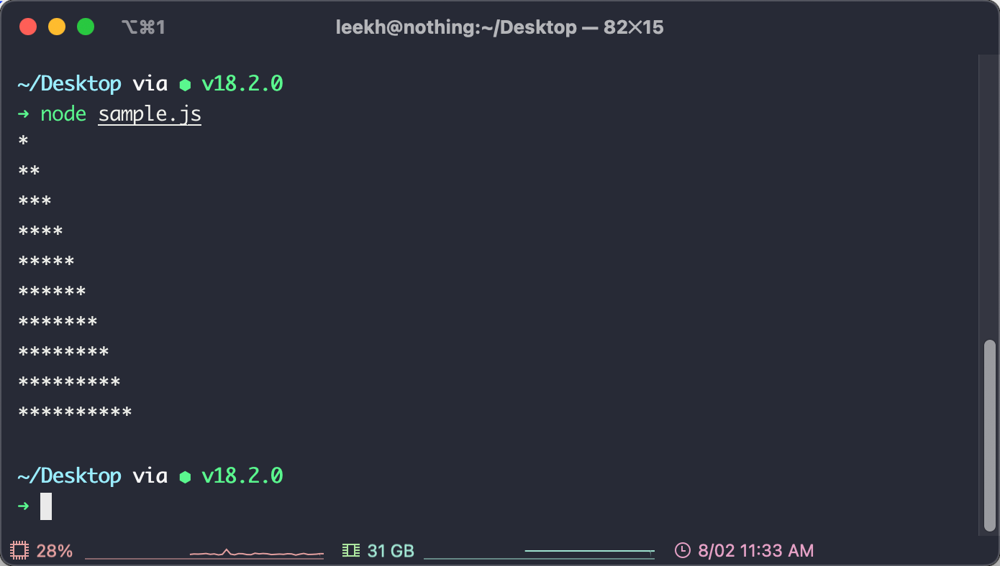

# **개발자환경구축,개발운영환경지원**02

# 운영체제의 이해

클라 - 요청 → 서버  

서버 ← 응답 - 클라  

웹사이트는 서버에 설치되어야 한다  

웹브라우저 - URL → 웹사이트  

웹브라우저 ← 웹페이지 - 웹사이트  

## 운영체제의 종류

### 1. 용도에 따른 구분

1. **클라이언트**용 운영체제  
**단일 사용자**용 운영체제  
윈도우 계열 : Window XP, 7, 8  
애플 계열 : MacOs  
2. **서버**용 운영체제  
**다중 사용자**용 운영체제  
동시에 여러 사용자의 서비스를 요청 받아 처리  
윈도우 서버(Windows Server) 계열  
유닉스(UNIX) 계열 : 리눅스 - 솔라리스(Solaris), Red Hat(Redhat), 페도라(fedora)  

대부분 상용 시스템 리눅스 기반 운영, 리눅스는 바탕화면 없이 명령어로만 제어해야 한다.  

### 명령어 환경

콘솔 → 쇼핑카드 + 모니터 + 키보드  

터미널 → 명령어를 입력하기 위한 프로그램  

쉘 → 터미널 안에서 동작하는 명령어 해석기  

리눅스, 맥 : Bash(기본), zsh(권장)  

Window: cmd(기본, 권장), powershell  

### 기본 명령어

| 기능  | Mac | Win  |
| --- | --- | --- |
| 현재 작업 폴더 이동 |  cd 이동할경로 | cd 이동할경로 |
| 현재폴더의 파일목록 보기 |  ls [옵션] [대상디렉토리경로]  
-l : 리스트 형태로 출력  
-a : 숨김 파일이나 숨김 디렉토리까지 출력  
-al : 숨김 파일이나 숨김 디렉토리를 포함하여 리스트 형태로 출력  
대상디렉토리경로가 지정된 경우 해당 경로 안의 항목을 표시한다.  
대상디렉토리경로가 지정되지않은 경우 현재 위치의 항목을 표시한다. | dir |
| 숨김파일을 포함한 파일목록 | ls -al | dir /A |
| 현재 위치 확인 | pwd | 명령프롬프트 상에 표시됨 |
| 파일 복사 | cp 원본경로 복사본경로 → cp a.txt b.txt  
폴더를 복사할 경우 -R 옵션 추가 → cp -R hello world   | copy 원본경로 복사본경로 |
| 파일,폴더 이동 | mv 원본경로 이동경로 | move 원본경로 복사본경로 |
| 파일 및 폴더 이름 변경 | mv  
mv 원본경로 대상경로 → 원본경로를 대상경로로 이동한다. 같은 폴더 안에서의 이동일 경우 이름 변경 효과가 있다. | rename |
| 파일 삭제 | rm [옵션] 삭제할파일경로  
-f : 강제로 파일이나 디렉토리를 삭제  
-r : 디렉토리 내부의 모든 내용을 삭제  
-d : 비어있는 디렉토리들만 제거  
-i : 매번 삭제할 때마다 사용자에게 삭제할 것인지 묻는다  
-v : 삭제되는 대상의 정보를 출력합니다   | del 삭제할파일경로 |
| 폴더 생성 | mkdir 생성할폴더경로 | mkdir 생성할폴더경로 |
| 폴더 삭제 | rmdir 삭제할폴더경로
(비어있지 않은 폴더는 삭제할 수 없다) | rmdir 삭제할폴더경로 |
| 비어 있지 않은 폴더 삭제 | rm -rf 삭제할폴더경로 | rmdir /S 삭제할폴더경로 |

### 파일 확장자

파일 확장자 → 파일의 종류를 결정하는 꼬리표 → 파일이름, 확장자

ex) helloworld.png, nicetime.avi

⇒ 컴퓨터 기본 설정에서 확장자 표시옵션을 활성화 해야 함

window, mac 각각 배포된 자료 참고

---

인텔리 제이 대학 메일로 무료 가능

---

## 마크다운

****Markdown All in One****

- 문법 색상 강조 등의 기본 기능

****Markdown PDF****

- pdf문서 변환

****Markdown Preview Github Styling****

- VSCode 내에서 미리보기 기능 제공

- 마크다운 문법

`밑줄 긋기는 <U>내용<U>`

```markdown
제목
====
소제목
-------
# This is a H1
## This is a H2
### This is a H3
#### This is a H4
##### This is a H5
###### This is a H6

2.3. 목록
● 순서있는 목록(번호)
순서있는 목록은 숫자와 점을 사용한다.
1. 첫번째
   1. ㅁ
2. 두번째
   1. 1
   2. 1
3. 세번째
   1. 1
      1. 2
         1. 3

현재까지는 어떤 번호를 입력해도 순서는 내림차순으로 정의된다.  

1. 첫번째
2. 세번째
3. 두번째

**마크다운 이미지 첨부**  


<U>딱히 개선될 것 같지는 않다. 존 그루버가 신경안쓰고 있다고...<U>  
// 밑줄 긋기는 <U> 내용 <U>
안녕하세요.  
반갑습니다
```

---

ctrl + shift + p ⇒ Markdown PDF Export(pdf)

노션에서 pdf 만들어서 제출 가능

```markdown
# 오태원 문제1 과제
> 2022-08-02

## 문제1

```javascript
for (let i=0; i<10; i++) {
    let s = "";
    for (let j=0; j<i+1; j++) {
        s += '*';
    }

    console.log(s);
}
```



# 윈도우 장치 드라이버 백업, 복구

### 파워쉘을 관리자 권한으로 실행하기

1. 윈도우키 + R
2. 파워쉘(powershell 입력)을 관리자 권한으로 실행한다
3. ctrl + shift + 엔터 = 관리자 권한 실행
4. 관리자 권한으로 실행된 powershell 창이 열림

### 드라이버 백업 하기

- C드라이브 혹은 D드라이브에 Driver라는 이름의 폴더를 생성한다. (임의의 이름 지정 가능함)
- 실행중인 파워쉘 프로그램에 아래의 명령어를 입력하고 엔터를 누른다.  
`Export-WindowsDriver -Online -Destination c:\Driver`
- 백업된 드라이버 파일 확인
- 미리 준비한 폴더 안에 드라이버가 백업되어 있는 것을 확인한다

> 포멧을 수행하면 C 드라이브 내의 모든 파일들은 삭제된다. 그러므로 C 드라이브에 장치 드라이버를 백업한 경우  
이 파일들을 USB나 외장하드 등에 미리 복사해 놓아야 한다.
> 

---

## 가상머신의 이해

### vmware 설치

원격 업무 공간 → 데스크톱 하이퍼바이저 → Workstation Player → **GO TO DOWNLOADS →** [https://customerconnect.vmware.com/en/downloads/details?downloadGroup=WKST-PLAYER-1624&productId=1039&rPId=91446](https://customerconnect.vmware.com/en/downloads/details?downloadGroup=WKST-PLAYER-1624&productId=1039&rPId=91446)  

- **VMware Workstation 16 Player 다운로드 및 설치 방법**

[https://hintbox.tistory.com/entry/VMware-Workstation-16-Player-다운-설치](https://hintbox.tistory.com/entry/VMware-Workstation-16-Player-%EB%8B%A4%EC%9A%B4-%EC%84%A4%EC%B9%98)  

- **VMware Workstation 16 Player 가상 머신 생성 및 윈도우 설치**

[https://hintbox.tistory.com/entry/VMware-Workstation-16-가상-머신-생성-및-윈도우-설치](https://hintbox.tistory.com/entry/VMware-Workstation-16-%EA%B0%80%EC%83%81-%EB%A8%B8%EC%8B%A0-%EC%83%9D%EC%84%B1-%EB%B0%8F-%EC%9C%88%EB%8F%84%EC%9A%B0-%EC%84%A4%EC%B9%98)  

---

## 윈도우 운영체제 설치하기

파티션 : **디스크 파티션**  
(disk partition) 작업은 [하드 디스크 드라이브](https://ko.wikipedia.org/wiki/%ED%95%98%EB%93%9C_%EB%94%94%EC%8A%A4%ED%81%AC_%EB%93%9C%EB%9D%BC%EC%9D%B4%EB%B8%8C)  
의 기억 공간을 "파티션"이라 알려진 별도의 데이터 영역으로 분할하는 것을 말한다.  

파티션 지정 주의하기  

사용자 이름 영어로 만들기  

- **부팅 USB 만들기 ( ISO파일을 USB에 굽기 )**  
[https://crone.tistory.com/295](https://crone.tistory.com/295)

- **Windows 11 디스크 이미지 (ISO) 다운로드**  
[https://www.microsoft.com/ko-kr/software-download/windows11](https://www.microsoft.com/ko-kr/software-download/windows11)

---

# Git준비하기

## Git의 이해

1. 팀장이 프로젝트를 생성하여 Git에 등록한다.
2. 나머지 팀원들은 Git에 등록된 프로젝트를 복제(Clone)한
다.
3. 야옹이는 복제된 프로젝트에 자신의 코드를 추가하여 Git
에 등록한다 (Push)
4. 나머지 팀원들은 야옹이가 추가한 내용을 내려받는다
(Pull)

## GitClient준비

GitSCM 설치하기 → 설치상의 특별한 부분은 없다.  

[https://git-scm.com/](https://git-scm.com/)  

## Git설정(Window,Mac공통)

### Git 사용자 설정 및 한글에 대한 옵션 지정

```bash
git config --globaluser.name "YourName"
git config --globaluser.email [you@your-domain.com](mailto:you@your-domain.com)
git config --globalcore.precomposeunicode true
git config --globalcore.quotepath false
```

## Github 가입

가입하기  

## 연동을 위한 인증서 등록

### 터미널이나 Cmder를 실행하고 다음의 명령어 수행

```bash
ssh-keygen
```

### 인증서 파일이 생성된 경로에 접근한다.

- 윈도우의 경우 à C:/Users/사용자이름/.ssh 폴더에 접근.
- 맥의 경우 à 터미널에서 "open~/.ssh" 명령어 입력.
- 인증서 폴더에서 확장자가 "id_rsa.pub" 파일을 텍스트 편집기로 연다

### Github 계정에 인증서 공개키 파일(*.pub) 등록

- 생성된 인증서 파일중 확장자가 "*.pub"인 파일을 텍스트 편집기로 열고 그 내용을 모두 복사하여 Github 페이지의 "Key"항목에 입력한다.
- title 은 편하게 입력한다.
- 설정 완료 후 비밀번호 확인창이 표시된다.

